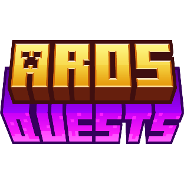
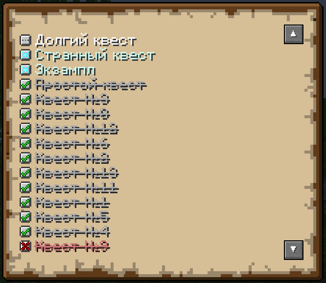
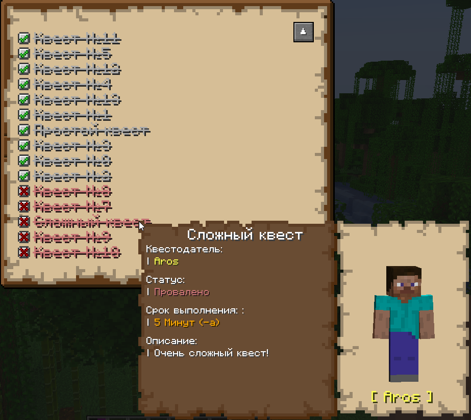

# ArosQuests

### By Aros
Мод, способный показать как можно реализовать квесты и из которого всегда можно взять код

## Функции
Вы можете создавать собственные квесты
```java
class ExampleQuest extends SimpleQuest {
    public ExampleQuest(Text name, Text author, @Nullable EntityType<? extends LivingEntity> authorEntity, Integer authorColor, Text description, QuestTime defaultTime) {
        super(name, author, authorEntity, authorColor, description, defaultTime);
    }
}
```
В регистрации
```java
class ModQuests {
    public static final ExampleQuest quest = register("my_quest", new ExampleQuest(...));
    
    static <E extends Quest> register(String name, E quest) {
        return Registry.register(AQRegistry.QUEST, new Identifier("modid", name), quest);
    }
}
```
### О QuestTime
Для задания сроков выполнения квесту используется класс `QuestTime`\
Вы можете отрегулировать время с помощью статичных методов

### Взаимодействие с квестами
Ставить квестам статусы, время, новый `QuestInstance`\
В коде:
```java
QuestState.setQuestStatus(Quest quest, QuestStatus status, MinecraftServer server);
QuestState.setQuestTime(Quest quest, int time, MinecraftServer server);
QuestState.setQuestIntance(Quest quest, QuestInstance instance, MinecraftServer server);
```
Или командой `/quest` в игре

### Крутой экран квестов
Экран синхронизирован между всемя игроками сервера (т.к. хранится в .dat файлах)

